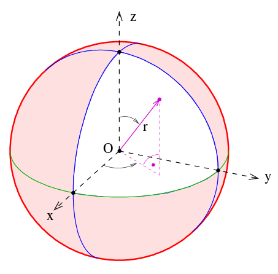

# friendFinder
friendFinder app

## [Hosted site](https://fictivefriendfinder.herokuapp.com/)

This app matches you based on a personality quiz survey score. Based on your answers, you can see which friend in the data store who is the closes match to your answers.

This app uses a node module package called Euclidean Distance to determine the distance between vectors in n-space. Because there are ten questions which measure a responsdent's personality in each of ten dimensions, and because each dimension has a total of five possible values, there is a personality space defined and every respondent's survey scores describes a vector in this 10-dimensional space. Using the distance method of the "euclidean-distance" node module easily provides the distance measurement from the user's vector to each person's vector which is in the data store file, friends.js. Distance is a positive scalar value, so an array of ten values is flattened to give only a single value.

After computing the distances between the user's vector and all possible friends' vectors, the distances are sorted, and the person in the data store having the smallest distance value between his score vectors and that of the user is considered the best match.

The server determines the match when the survey page submits the user's answers to the server via a HTTP POST submission. The front end client (browser) submits this POST request in the form of an Ajax request. Once the server has a best match, the server returns the name, the match score (or distance value), and the GIF of the match. This information is recieved by the client's Ajax call, and is displayed in a "modal" pop-up window.

### Possible improvments:

1. Right now there is only one match being returned. In the future, we could change this so that a list of ranked matches is returned. After all, the server has to compute the distance for every person in the friends data store, so we might as well display more of the ranked list if we are going to the trouble of ranking all of them. Also, at the very least we should consider displaying tie scores for best match, because current behavior just shows a single match if there are two or more with scores which are equidistant from the user's input.

2. In  the future we could actually save the user's data input, and allow the users's inputed data to be considered against future users' matches.

3. The scalability of this design should be investigated. As the size of the data store grows, and as the complexity of the personality inventory increases, the amount of computing power needed to compute distances and rank the list grows as well. There may be efficiency gains to be made, to prevent the situation where the server is being bogged down from ever-increasing overhead.

For scalability, we may want to consider prioritizing and eliminating groups of friends from those we wish to compare and thus reduce the computational load on the server, which currently checks the user input data against all friends in the database. So having a way to identify a set of only the nearest / some of the nearest to rank will eliminate much unnecessary overhead, as will limiting the precision of the distance calculation to only what is needed to determine distance ranking.

One way to do this may involve converting the n-dimentional rectangular coordinates into n-dimensional spherical coordinates, and only considering / ranking those nearest to the user's radius, or distance from the origin. If we only consider points those within an absolute value difference of a certain increment from the user's input, then we are searching a region of space equivalent to a n-hemisphere (because all values only run from 1 to 5, or 0 to 4 if you want to consider it that way, resulting in a total of 330 unique planes formed by the 10 orthogonal dimensions which have a maximum of 90 degrees of separation between axes. In other words, theta between any two points can not exceed 90 degrees, which provides a convenient limit to the maximum absolute separation possible between two points in the space.

Another way to do this would be to limit comparison to those in neighboring regions or "quadrants". Perhaps overlapping neighborhoods, more than one to each friend, could be applied to the points, and could be used to filter the list of points which should be compared and ranked in terms of absolute distance.

This image below illustrates that only the positive sub-sphere (of n dimensions, where n is the number of axes in our personality inventory). Only the positive sub-sphere is the region inhabitated by our data points.

